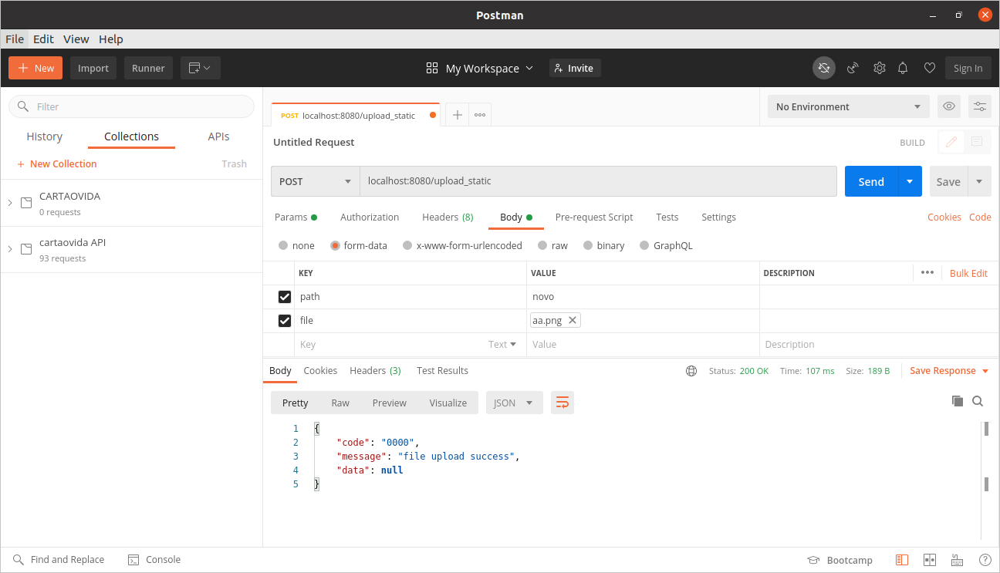
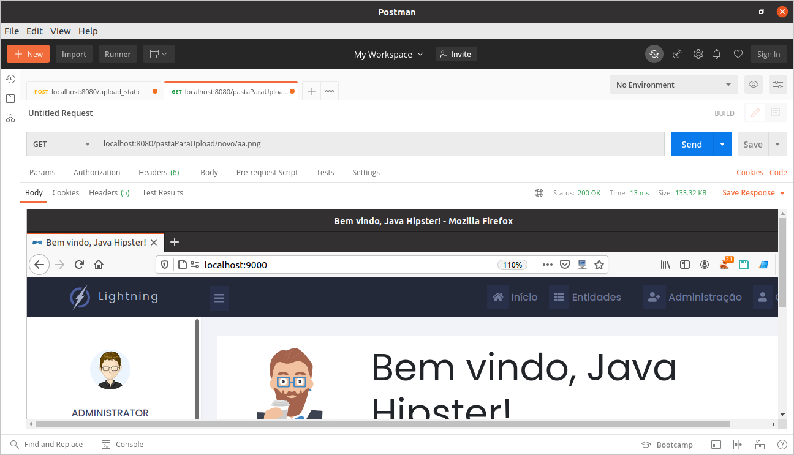

# Projeto forkado de outro repositorio 

## Endpoint /upload_static
EndPoint para upload de arquivo em src/main/java/staticFileServer/api/FileUploadController.java 

## Recurso estático (Static Resource)
A pastaParaUpload  é onde será gravado as imagens para uso público.

## Classe de configuração
Foi adicionando a classe AdditionalResourceWebConfiguration.java dentro do src/main/java/staticFileServer/config/ para transformar a pasta pastaParaUpload em um recurso estático.

## Testando
Para testar abra o postman e siga essa foto

com a image aa.png (ou outro nome) na pasta pastParaUpload/novo (ou outro path) é só acessar
a url 
localhost:8080/pastaParaUpload/novo/aa.png e visualizar a foto

